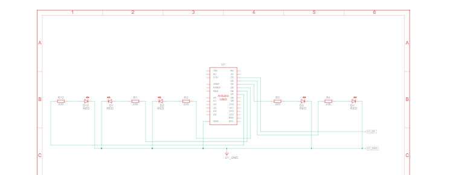

# Pertemuan 1

## 1.5.4. Pertanyaan Praktikum

1. Pada kondisi apa program masuk ke blok if? 
2. Pada kondisi apa program masuk ke blok else?
3. Apa fungsi dari perintah delay(timeDelay)?
4. Jika program yang dibuat memiliki alur mati → lambat → cepat → reset (mati), ubah menjadi LED tidak langsung reset → tetapi berubah dari cepat → sedang → mati dan berikan penjelasan disetiap baris kode nya dalam bentuk README.md!

Jawab   :
1. Pada saat  nilai timeDelay <== 100 maka program akan masuk ke blok if.Saat LED kedip semakin cepat dan delay mencapai 100ms atau kurang,program mengetahui jika silkus percepatan selesai dan akan memberikan jeda 3 detik lalu mereset timeDelay kembalik ke 1000ms.

2. Ketika timeDelay>100 maka akan masuk ke blok else.Program akan mengurangi timeDelay -100ms disetiap loop selama kondisi masih timeDelay >100ms.

3. Memberikan jeda Waktu antara LED untuk menyala dan mati dalam satuan milidetik(ms)</p>
4. ```
    tunggu dulu nanti
    ```

## 1.6.4 Pertanyaan Praktikum

1. Gambarkan rangkaian schematic 5 LED running yang digunakan pada percobaan!

2. Jelaskan bagaimana program membuat efek LED berjalan dari kiri ke kanan!

3. Jelaskan bagaimana program membuat LED kembali dari kanan ke kiri!

4. Buatkan program agar LED menyala tiga LED kanan dan tiga LED kiri secara bergantian
dan berikan penjelasan disetiap baris kode nya dalam bentuk README.md!

Jawab   :

1. Gambar schematic : <br>


link    : https://www.tinkercad.com/things/fqY1QaodUZZ-rangkaian-schematic?sharecode=Dg_ttdRqBKpq6oZidapZf-pGvgPO2UXSGvVhIDrx1-g

3. Program menggunakan for untuk membuat efek LED dari kiri ke kanan.Loop for mulai dari pin 2 sampai pin < 8 yang setiap itearasi menyalakan LED dengan delay yang sudah di tentukan lalu mematikan kembali LED.LED dipasang secara urut dari pin 2 sampai 7 untuk membuat visual cahaya dari kiri ke kanan.

4. Program menggunakan for kembali untuk loop dari kanan ke kiri.Sekarang loop di mulai dari pin 7 sampai pin >=2.Hal ini membuat LED menyala berurutan mundur dari pin 7 sampai pin 2.

5. ```
    tunggu dulu nanti
    ```

